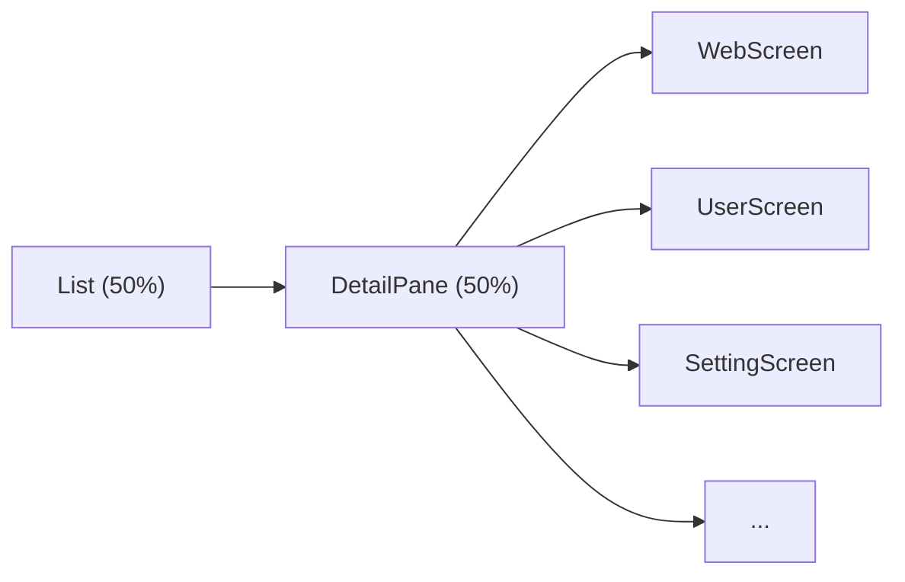

# Locales & Contributors
- de_en English  *by DeepSeek-V4-Pro*

# Preface
At first glance learning Kotlin was quite difficult, tutorials and videos focused on knowledge points but lacked practical project examples. To overcome this hurdle I created fragmject which provides an example app that demonstrates core features of both Kotlin and Jetpack Compose while keeping things simple enough for beginners to grasp quickly. Special thanks goes out to Wan Android who provide their open API for use with this project!

# Introduction
Fragmject is designed as an easy starting point for those new to programming with Kotlin and Jetpack Compose. By leveraging these technologies we are able to create a fully featured production ready application that adheres strictly to best practices outlined by Google themselves. Fragmject avoids complex business logic or unnecessary layers of abstraction; it simply implements everything according to how you would do so in real life projects following official guidelines provided by Android Developers website. Code is concise yet comprehensive making it straightforward even for someone without any prior experience. It will help you understand design patterns employed elsewhere alongside various techniques used for dependency injection and view binding.

### Tech Stack
- **Language**: Kotlin 2.4.x + Compose
- **Architecture**: MVVM / MVI hybrid, multi-module (`core` + `feature` + `app`)
- **Navigation**: Navigation 3 (`NavBackStack` + `NavDisplay`)
- **UI**: Material 3 + WindowSizeClass adaptive layout
- **DI**: Hilt
- **Database**: Room 3
- **Network**: Retrofit + OkHttp
- **Build**: Gradle Kotlin DSL + Version Catalog + Convention Plugins

By working through this project you'll gain valuable insights into several areas such as:
- Kotlin + Compose declarative UI
- Navigation 3 (type-safe navigation + List-Detail side-by-side)
- WindowSizeClass adaptive layout for tablets / foldables
- MVVM, MVI
- Custom views built from scratch including image pickers, editors, datepickers etc...
- Advanced topics like bytecode manipulation via ASM library

## Development Environment
In order for you to run this project normally, please use the latest preview version of Android Studio. You can download it at the following address:
[Download Android Studio | Android Developer](https://developer.android.google.cn/studio/preview?hl=en)

## Pre knowledge
Before diving into this project, here are some basic concepts you might want to familiarize yourself with:
- [Learn the Kotlin programming language | Android Developer](https://developer.android.google.cn/kotlin/learn?hl=en)
- [Learn Kotlin by Example | Android Developer](https://play.kotlinlang.org/byExample/overview)
- [ViewModel | Android Developer](https://developer.android.google.cn/topic/libraries/architecture/viewmodel?hl=en)
- [Coroutines | Android Developer](https://developer.android.google.cn/kotlin/coroutines?hl=en)
- [Room | Android Developer](https://developer.android.google.cn/training/data-storage/room?hl=en)
- [Compose | Android Developer](https://developer.android.google.cn/jetpack/compose)

## Beginner's Advice

If you prefer a codebase with less abstraction and more straightforward code to get started quickly, we recommend switching to the [v1.4.0](https://github.com/miaowmiaow/fragmject/tree/v1.4.0) tag, which keeps a simpler implementation without the complex architectural layering and wrappers, making it easier to understand and learn.

## Screenshot display
|  |  |  |
| ------------------------------------------------------------ |------------------------------------------------------------------------------------------|------------------------------------------------------------------------------------------|

## Project Directory Structure
```
├── app                                          app shell module
|  └── src
|     └── main
|     |   ├── assets                             assets (HTML/JS/JSON mock data)
|     |   └── java                               source code
|     |      ├── MainActivity.kt                 single Activity
|     |      ├── FragmjectApplication.kt         Application (Hilt entry)
|     |      └── AppNavGraph.kt                  navigation graph (Navigation 3 + WindowSizeClass)
|     |
|     ├── build.gradle.kts                       module build config
|     ├── dictionary                             custom obfuscation dictionary
|     └── proguard-rules.pro                     code obfuscation config
| 
├── core                                         core layer (foundation, no business dependencies)
|  ├── android-platform                          platform & process-level utilities (AppScope / BaseContentProvider / File* / CacheUtils / UriPathHelper)
|  ├── data-contract                             data port contracts (remote/local DataSource + HTTP protocol models)
|  ├── data-impl                                 data implementation (RepositoryImpl / PagingSource / Hilt bindings)
|  ├── database                                  database (Room 3)
|  ├── designsystem                              design system (AppTheme / WindowSizeClass / components)
|  ├── domain                                    domain layer (Repository interfaces + UseCase + DomainResult)
|  ├── model                                     data models
|  ├── navigation                                navigation capability (Navigation 3 type-safe routes)
|  ├── navigation-contracts                      navigation contracts (semantic Navigator, cross-feature decoupling)
|  ├── network                                   network layer (Retrofit + OkHttp)
|  ├── player                                    playback capability (Media3)
|  ├── ui                                        UI component library (FeedCard / SwipeRefreshBox etc.)
|  └── webview                                   WebView capability
| 
├── feature                                      feature modules (each contains api / impl submodules)
|  ├── article                                   article module (WebView detail / download / playback)
|  |  ├── api                                    API layer (NavKey definitions)
|  |  └── impl                                   implementation layer (Screen / ViewModel)
|  ├── auth                                      login / signup
|  ├── collection                                favorites / shares
|  ├── demo                                      component demos (calendar / image picker / drag etc.)
|  ├── home                                      home (Home / Nav / Project / System / My)
|  ├── picture                                   picture module (picker / preview / editor)
|  ├── search                                    search
|  └── user                                      user (profile / points / ranking / settings / history)
| 
├── build-logic                                  build logic (Gradle Convention Plugins)
|  └── convention
|     └── src/main/kotlin
|        ├── FragmjectAndroidApplicationPlugin   application convention plugin
|        ├── FragmjectAndroidComposePlugin       compose convention plugin
|        ├── FragmjectAndroidFeaturePlugin       feature convention plugin
|        ├── FragmjectAndroidHiltPlugin          Hilt convention plugin
|        ├── FragmjectAndroidLibraryPlugin       library convention plugin
|        └── FragmjectAndroidRoomPlugin          Room convention plugin
|
├── gradle
|  └── libs.versions.toml                        version catalog
|
├── build.gradle.kts                             project build config
├── config.properties                            project config
├── gradle.properties                            gradle config
└── settings.gradle.kts                          module dependency config
```

## Download
- [](https://github.com/miaowmiaow/fragmject/blob/master/app/free/release/wan-release-1.6.0-free.apk)

## Adaptive Layout (WindowSizeClass)
The project implements full adaptive layout for tablets and foldables using `material3-window-size-class`.

### Layout Strategy
| Window Size | Width | Navigation Component | Detail Display |
|-------------|-------|---------------------|----------------|
| **Compact** | < 600dp | `NavigationBar` (bottom bar) | full-screen push |
| **Medium** | 600–840dp | `NavigationDrawerItem` + `Surface` (left nav) | full-screen push |
| **Expanded** | ≥ 840dp | `PermanentNavigationDrawer` (persistent rail) | side-by-side panel |

### List-Detail
In Expanded mode (tablet landscape / desktop), tapping articles, user profiles, settings, etc. renders in the right-side panel instead of full-screen navigation:



### Key Files
- [LocalWindowSizeClass.kt](core/designsystem/src/main/java/com/example/fragmject/core/designsystem/LocalWindowSizeClass.kt) — `CompositionLocal` injection + helper extensions
- [AppNavGraph.kt](app/src/main/java/com/example/fragmject/app/navigation/AppNavGraph.kt) — intercepts `NavKey` in Expanded mode, forwards to `DetailPane`
- [MainScreen.kt](feature/home/impl/src/main/java/com/example/fragmject/feature/home/ui/main/MainScreen.kt) — three-layout dispatch + `DetailPane` routing

### Usage
```kotlin
val windowSizeClass = LocalWindowSizeClass.current
when (windowSizeClass.widthSizeClass) {
    WindowWidthSizeClass.Compact -> CompactLayout()
    WindowWidthSizeClass.Medium  -> MediumLayout()
    WindowWidthSizeClass.Expanded -> ExpandedLayout()
}
```

## Jetpack Compose

#### Less code
Using Compose instead of the traditional Android View system enables us to accomplish more with less code, leading to fewer lines of code needing testing and debugging, and lower likelihood of bugs occurring. This makes maintenance easier for reviewers and maintainers alike, reducing the amount of code that needs to be read, understood, approved, and maintained.

Composereflects a simpler concept in itslayout system,whereallcodeiswritten in one language and located within thesamefile,eliminating theneedfor back-and-forth switching between Kotlin andXML.

#### Intuitive
User's Question: Compose uses declarative APIs which mean that you only have to define the interface without worrying about how to implement each step.

By leveraging Compose, you can create smaller statelesscomponents that aren't attached to any particular activity or fragment.

In Compose, state is explicit and passed down tocomposable elements allowing them to maintain their integrity while being isolated from other parts of the app. When the statechanges, the UI updates automatically.

#### Mutually compatible
Compose is compatible with all your existing code: you can call Compose code from View or call View from Compose. Most commonly used libraries, such as Navigation, ViewModel, and Kotlin coroutine, are suitable for Compose, so you can start adopting them anytime, anywhere.

## SharedFlowBus

#### Quick access
```
// send message
SharedFlowBus.with(objectKey: Class<T>).tryEmit(value: T)

// send sticky message
SharedFlowBus.withSticky(objectKey: Class<T>).tryEmit(value: T)

// subscribe message
SharedFlowBus.on(objectKey: Class<T>).observe(owner){ it ->
    println(it)
}

// subscribe sticky message
SharedFlowBus.onSticky(objectKey: Class<T>).observe(owner){ it ->
    println(it)
}
```

## Picture editor（feature/picture）

### Screenshot display
|  |  |  |
|-------------------------------------------------------------------------------------------|------------------------------------------------------------------------------------------|------------------------------------------------------------------------------------------|

#### Quick access
```
PictureEditorDialog.newInstance()
    .setBitmapPath(path)
    .setEditorFinishCallback(object : EditorFinishCallback {
        override fun onFinish(path: String) {
            val bitmap = BitmapFactory.decodeFile(path, BitmapFactory.Options())
        }
    })
    .show(childFragmentManager)
```

If you feel that PictureEditorDialog cannot meet the requirements, you can also customize the style through PictureEditorView.
#### Custom usage
```
<com.example.miaow.picture.editor.PictureEditorView
    android:id="@+id/pic_editor"
    android:layout_width="match_parent"
    android:layout_height="match_parent" />
```
```
picEditor.setBitmapPath(path)
picEditor.setMode(PictureEditorView.Mode.STICKER)
picEditor.setGraffitiColor(Color.parseColor("#ffffff"))
picEditor.setSticker(StickerAttrs(bitmap))
picEditor.graffitiUndo()
picEditor.mosaicUndo()
picEditor.saveBitmap()
```

That's all for PictureEditorView. For specific usage, please refer to PictureEditorDialogs.
#### Picture cropping
```
<com.example.miaow.picture.editor.PictureClipView
    android:id="@+id/clip"
    android:layout_width="match_parent"
    android:layout_height="match_parent" />
```
```
clip.setBitmapResource(bitmap)
clip.rotate()
clip.reset()
clip.saveBitmap()
```

That's all for PictureClipView. For specific usage, please refer to PictureClipDialogs.
#### Picture selection
```
if (context is AppCompatActivity) {
    PictureSelectorDialog.newInstance()
        ...
        .show(context.supportFragmentManager)
}
```

## Calendar


#### Source location
```
└── feature
    └── demo
       └── impl
          └── ui
             └── calendar
                └── CalendarScreen.kt
```

#### Quick access
```
val calendarState = rememberCalendarState()
calendarState.addSchedule(text)

Calendar(
    state = calendarState,
    modifier = Modifier.padding(vertical = 15.dp),
    onSelectedDateChange = { y, m, d ->
        println("CalendarScreen: $y - $m - $d")
    }
)
```

## Main open-source libraries
- [coil-kt/coil](https://github.com/coil-kt/coil)
- [google/gson](https://github.com/google/gson)
- [square/okhttp](https://github.com/square/okhttp)
- [square/retrofit](https://github.com/square/retrofit)

## Gitee
- [fragmject](https://gitee.com/zhao.git/FragmentProject.git)

## About me
- QQ群 : 389499839
- JueJin：[miaowmiaow](https://juejin.cn/user/3342971112791422)

## Thanks
Thank you to all outstanding open source projects^_^

If you like it, I hope to give it to Star or Fork^_^

Thank you~~
