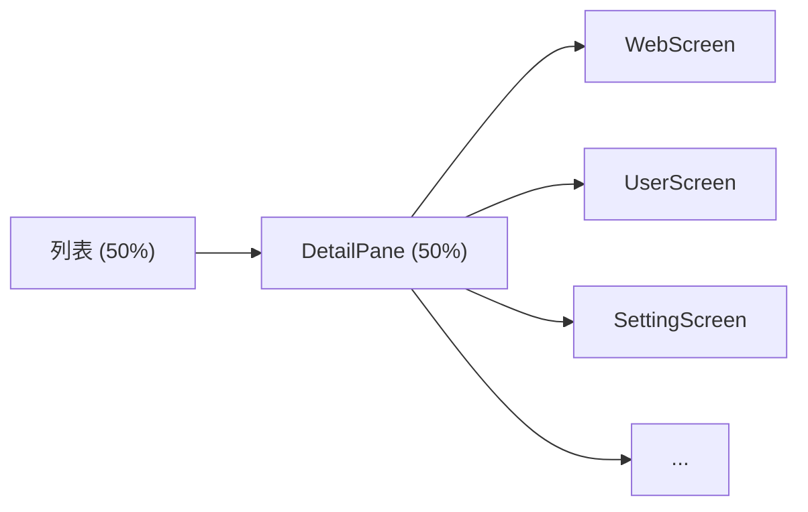

*Read this in [English](README.EN.md)*

## 前言
刚开始学习 `Kotlin` 其实挺痛苦的，相关的书籍或视频偏向于知识点的讲解，没有完整的项目实操。   
开源项目业务复杂，代码层层封装，用来上手实在不合适，于是便有了 `fragmject` 项目。   
在此感谢 [玩Android](https://www.wanandroid.com/) 及其提供 [开放API](https://wanandroid.com/blog/show/2) 。

## 简介
`fragmject` 是一个为初学者准备的上手项目。   
通过对 `Kotlin` 和 `Compose` 的系统运用，实现的一个功能完备符合主流市场标准应用。   
`fragmject` 没有复杂的业务和多余的封装， 完全依照 [Android Developer](https://developer.android.google.cn/) 官方的写法。   
代码简单，内容全面，快速上手，对理解其他项目设计思想和封装技巧也很有帮助。

### 技术栈
- **语言**：Kotlin 2.4.x + Compose
- **架构**：MVVM / MVI 混合，多模块（`core` + `feature` + `app`）
- **导航**：Navigation 3（`NavBackStack` + `NavDisplay`）
- **UI**：Material 3 + WindowSizeClass 大屏自适应
- **DI**：Hilt
- **数据库**：Room 3
- **网络**：Retrofit + OkHttp
- **构建**：Gradle Kotlin DSL + Version Catalog + Convention Plugins

学习本项目你将有如下收获：
- Kotlin + Compose 声明式 UI
- Navigation 3（类型安全导航 + List-Detail 同屏）
- WindowSizeClass 大屏/折叠屏自适应
- MVVM、MVI
- 常用控件封装（图片选择器、图片编辑器、日历控件、滚轮控件、全面屏沉浸、屏幕录制...）
- 字节码插桩（ASM...）

## 开发环境
为了您能正常运行本项目，请先更新你的 `Android Studio` (可能需要梯子)。   
[Download Android Studio | Android Developer](https://developer.android.google.cn/studio?hl=zh-cn)   
您也可以自行配置 `AGP` 和 `compose`来进行适配。 [libs.versions.toml](https://github.com/miaowmiaow/fragmject/blob/master/gradle/libs.versions.toml)   

## 将 Android 应用迁移到版本目录
[将 build 迁移到版本目录 | Android Developer](https://developer.android.google.cn/studio/build/migrate-to-catalogs?hl=zh-cn)

## 前置知识
在学习前希望您能了解以下知识，这将帮助您更快的上手本项目。
- [Kotlin 语言学习 | Android Developer](https://developer.android.google.cn/kotlin/learn?hl=zh_cn)
- [Kotlin 代码示例 | Android Developer](https://play.kotlinlang.org/byExample/overview)
- [ViewModel 使用入门 | Android Developer](https://developer.android.google.cn/topic/libraries/architecture/viewmodel?hl=zh_cn)
- [Coroutines 使用入门 | Android Developer](https://developer.android.google.cn/kotlin/coroutines?hl=zh_cn)
- [Room 使用入门 | Android Developer](https://developer.android.google.cn/training/data-storage/room?hl=zh_cn)
- [Compose 使用入门 | Android Developer](https://developer.android.google.cn/jetpack/compose)

## 为什么很少依赖其他库
在日常开发中我推荐使用 `Hilt` 、 `Paging` 等库，不仅提高效率也能减少bug。   
但是初学者过早依赖第三方库，可能会有以下危害：
- 增加学习负担，第三方库用起来简单但是底层实现往往复杂，阅读源码容易打击学习积极性。
- 造成基础薄弱，初学者容易把第三方库能力当成自己的能力，脱离第三方库开发能力大大下降。

因此，本项目尽量多去自己实现，可能不是很优雅但一定能让你学习到更多。

## 截图展示
|  |  |  |
| ------------------------------------------------------------ |------------------------------------------------------------------------------------------|------------------------------------------------------------------------------------------|

## 项目目录结构
```
├── app                                         app 壳工程
|  └── src
|     └── main
|     |   ├── assets                            assets 目录（HTML/JS/JSON 测试数据）
|     |   └── java                              源码目录
|     |      ├── WanActivity.kt                 唯一 Activity
|     |      ├── WanApplication.kt              Application（Hilt 入口）
|     |      └── WanNavGraph.kt                 导航图（Navigation 3 + WindowSizeClass 自适应）
|     |
|     ├── build.gradle.kts                      模块构建配置
|     ├── dictionary                            自定义混淆字典
|     └── proguard-rules.pro                    代码混淆配置文件
| 
├── core                                        核心层（基础能力，不依赖业务）
|  ├── common                                   公共工具（TransitionGuard 等）
|  ├── data                                     数据层（Repository）
|  ├── database                                 数据库（Room 3）
|  ├── designsystem                             设计系统（WanTheme / WindowSizeClass / 组件）
|  ├── domain                                   领域层
|  ├── model                                    数据模型
|  ├── network                                  网络层（Retrofit + OkHttp）
|  └── ui                                       UI 组件库（ArticleCard / BannerPager / SwipeRefreshBox 等）
| 
├── feature                                    功能模块层
|  ├── picture                                  图片模块（选择器 / 预览 / 编辑器）
|  |  ├── api                                   API 层（NavKey 定义）
|  |  └── impl                                  实现层（Screen / ViewModel）
|  └── wan                                      wan 主业务模块
|     ├── api                                    API 层（NavKey 统一路由表）
|     └── impl                                   实现层
|        ├── main                               首页（Home / Nav / Project / My）
|        ├── login                              登录 / 注册
|        ├── search                             搜索
|        ├── system                             知识体系
|        ├── user                               用户主页
|        ├── web                                WebView 文章详情
|        ├── setting                            系统设置
|        ├── my_coin                            我的积分
|        ├── my_collect                         我的收藏
|        ├── my_share                           我的分享
|        ├── rank                               积分排行榜
|        ├── browse_history                     浏览历史
|        ├── share                              新建分享
|        └── demo                               组件 Demo
| 
├── build-logic                                 构建逻辑（Gradle Convention 插件）
|  └── convention
|     └── src/main/kotlin
|        ├── FragmjectAndroidApplicationPlugin   application 约定插件
|        ├── FragmjectAndroidComposePlugin       compose 约定插件
|        ├── FragmjectAndroidFeaturePlugin       feature 约定插件
|        ├── FragmjectAndroidHiltPlugin          Hilt 约定插件
|        ├── FragmjectAndroidLibraryPlugin       library 约定插件
|        └── FragmjectAndroidRoomPlugin          Room 约定插件
|
├── gradle
|  └── libs.versions.toml                       版本目录（统一依赖管理）
|
├── build.gradle.kts                            项目构建配置
├── config.properties                           项目配置
├── gradle.properties                           gradle 配置
└── settings.gradle.kts                         项目模块依赖配置
```
## 下载体验
- [](https://github.com/miaowmiaow/fragmject/blob/master/app/free/release/wan-release-1.6.0-free.apk)

## 大屏自适应（WindowSizeClass）
项目基于 `material3-window-size-class` 实现了完整的大屏/折叠屏自适应布局。

### 布局策略
| 窗口尺寸 | 宽度 | 导航组件 | 详情展示 |
|---------|------|---------|---------|
| **Compact** | < 600dp | `NavigationBar`（底部导航栏） | 全屏推入 |
| **Medium** | 600–840dp | `NavigationDrawerItem` + `Surface`（左侧导航） | 全屏推入 |
| **Expanded** | ≥ 840dp | `PermanentNavigationDrawer`（常驻侧栏） | 右侧面板同屏 |

### 列表-详情同屏（List-Detail）
Expanded 模式下（平板横屏/桌面），点击文章、用户主页、系统设置等页面不再全屏跳转，而是在右侧面板渲染：



### 涉及文件
- [LocalWindowSizeClass.kt](core/designsystem/src/main/java/com/example/fragmject/core/designsystem/LocalWindowSizeClass.kt) — `CompositionLocal` 注入 + 便捷扩展
- [WanNavGraph.kt](app/src/main/java/com/example/fragment/project/WanNavGraph.kt) — Expanded 模式拦截 `NavKey`，传递给 `DetailPane`
- [MainScreen.kt](feature/wan/impl/src/main/java/com/example/fragmject/feature/wan/main/MainScreen.kt) — 三态布局分发 + `DetailPane` 路由

### 使用方式
```kotlin
val windowSizeClass = LocalWindowSizeClass.current
when (windowSizeClass.widthSizeClass) {
    WindowWidthSizeClass.Compact -> CompactLayout()
    WindowWidthSizeClass.Medium  -> MediumLayout()
    WindowWidthSizeClass.Expanded -> ExpandedLayout()
}
```

## Jetpack Compose
如果你暂时不需要 `Compose` ，可以切换到 Tags [v1.3.0](https://github.com/miaowmiaow/fragmject/tree/v1.3.0) 。

#### 更少的代码
与使用 `Android View` 系统相比，`Compose` 可让我们用更少的代码实现更多的功能，这样需要测试和调试的代码会更少，出现 bug 的可能性也更小。对于审核人员或维护人员，需要阅读、理解、审核和维护的代码就更少。   
`Compose` 的布局系统在概念上更简单，所有代码都使用同一种语言编写并且位于同一文件中，而不必在 `Kotlin` 和 `XML` 二者之间来回切换。

#### 直观
`Compose` 使用声明性API，这意味着您只需描述界面，`Compose` 会负责完成其余工作。   
利用 `Compose` ，您可以构建不与特定 `activity` 或 `fragment` 相关联的小型无状态组件。   
在 `Compose` 中，状态是显式的，并且会传递给相应的可组合项。这样一来，状态便具有单一可信来源，因而是封装和分离的。然后，应用状态变化时，界面会自动更新。

#### 相互兼容
`Compose` 与您所有的现有代码兼容：您可以从 `View` 调用 `Compose` 代码，也可以从 `Compose` 调用 `View` 。大多数常用库（如 `Navigation` 、 `ViewModel` 和 `Kotlin` 协程）都适用于 `Compose` ，因此您可以随时随地开始采用。

- [Jetpack Compose : 从改造你的登录页面开始](https://juejin.cn/post/7156425159249756191)
- [Jetpack Compose : 一学就会的自定义下拉刷新&加载更多](https://juejin.cn/post/7185159395519496250)
- [Jetpack Compose : 优雅的使用WebView](https://juejin.cn/post/7194360493866221628)
- [Jetpack Compose : 一文学会嵌套滚动NestedScrollConnection](https://juejin.cn/spost/7239610698116055098)
- [Jetpack Compose : 超简单实现滚轮控件(WheelPicker)](https://juejin.cn/post/7266702105829277754)
- [Jetpack Compose : 超简单实现文本展开和收起](https://juejin.cn/post/7317132381013082122)
- [Jetpack Compose : 超简单实现侧滑删除](https://juejin.cn/spost/7325259560523677747)
- [Jetpack Compose : 超简单实现侧滑删除（威力加强版）](https://juejin.cn/post/7350824272321314854)
- [Jetpack Compose : 使用 Compose Compiler Gradle 来设置 Compose](https://juejin.cn/post/7404130389985771546)

## WebView 优化及 H5 秒开实践
- [满满的 WebView 优化干货，让你的 H5 实现秒开体验](https://juejin.cn/post/7043706765879279629)
- [Jetpack Compose : 优雅的使用WebView](https://juejin.cn/post/7194360493866221628)


## SharedFlowBus
[SharedFlowBus：30行代码实现消息总线你确定不看吗](https://juejin.cn/post/7028067962200260615)

#### 快速使用
```
// 发送消息
SharedFlowBus.with(objectKey: Class<T>).tryEmit(value: T)

// 发送粘性消息
SharedFlowBus.withSticky(objectKey: Class<T>).tryEmit(value: T)

// 订阅消息
SharedFlowBus.on(objectKey: Class<T>).observe(owner){ it ->
    println(it)
}

// 订阅粘性消息
SharedFlowBus.onSticky(objectKey: Class<T>).observe(owner){ it ->
    println(it)
}
```

## 字节码插桩
[最通俗易懂的字节码插桩实战 —— 优雅的打印方法执行时间](https://juejin.cn/post/6986848837797658637)

[最通俗易懂的字节码插桩实战 —— 自动埋点](https://juejin.cn/post/6985366891447451662)

#### 隐私合规 ———— 替换目标字段或方法（library-plugin）
[一文学会字节码替换，再也不用担心隐私合规审核](https://juejin.cn/post/7121985493445083149)

#### 源码位置
```
├── library-plugin                              
|  └── src 
|     └── main 
|        ├── kotlin                             
|        └── resources                          
|           └── statistic.properties            插件配置
| 
└── repos                                       插件生成目录                  
```

#### 快速使用
在 `MiaowPlugin` 添加 `ScanBean` 并配置目标字段或方法以及对应的替换字段或方法。
```
ScanBean(
    owner = "android/os/Build",
    name = "BRAND",
    desc = "Ljava/lang/String;",
    replaceOpcode = Opcodes.INVOKESTATIC,
    replaceOwner = "com/example/fragment/library/common/utils/BuildUtils",
    replaceName = "getBrand",
    "()Ljava/lang/String;"
)
```

#### 耗时扫描 ———— 打印方法执行时间
在 `MiaowPlugin` 添加 `TimeBean` 并配置打印目标或范围。
```
TimeBean( //以包名和执行时间为条件
    "com/example/fragment/library/base",
    time = 50L
)
```

#### 埋点统计 ———— 自动埋点
在 `MiaowPlugin` 添加 `TraceBean` 并配置埋点目标以及对应埋点方法。
```
TraceBean(
    owner = "Landroid/view/View\$OnClickListener;",
    name = "onClick",
    desc = "(Landroid/view/View;)V",
    traceOwner = "com/example/fragment/library/common/utils/StatisticHelper",
    traceName = "viewOnClick",
    traceDesc = "(Landroid/view/View;)V" //参数应在desc范围之内
)
```
配置完成后 `gradle` 执行 `publish` 任务生成插件。   
在根目录 `setting.gradle` 添加本地插件源。
```
pluginManagement {
    repositories {
        maven {
            url uri('repo')
        }
    }
}
```
在根目录 `build.gradle` 添加插件依赖。
```
buildscript {
    dependencies {
        classpath 'com.example.miaow:plugin:1.0.0'
    }
}
```
在app目录 `build.gradle` apply插件。
```
plugins {
    id 'miaow'
}
```

## 图片编辑器（feature/picture）
[自己动手撸一个图片编辑器（支持长图）](https://juejin.cn/post/7013274417766039560)

### 截图展示
|  |  |  |
|-------------------------------------------------------------------------------------------|------------------------------------------------------------------------------------------|------------------------------------------------------------------------------------------|

#### 源码位置
```
└── feature
    └── picture
       ├── api      API 层
       └── impl     实现层
```

#### 快速使用
```
PictureEditorDialog.newInstance()
    .setBitmapPath(path)
    .setEditorFinishCallback(object : EditorFinishCallback {
        override fun onFinish(path: String) {
            val bitmap = BitmapFactory.decodeFile(path, BitmapFactory.Options())
        }
    })
    .show(childFragmentManager)
```
如上所示：
1. 通过 `PictureEditorDialog` 调用图片编辑器。
2. 通过 `setBitmapPath(path)` 传入图片路径。
3. 通过 `setEditorFinishCallback(callback)` 获取编辑后的图片地址。

如果觉得 `PictureEditorDialog` 不能满足需求，还可以通过 `PictureEditorView` 来自定义样式。

#### 自定义使用
```
<com.example.miaow.picture.editor.PictureEditorView
    android:id="@+id/pic_editor"
    android:layout_width="match_parent"
    android:layout_height="match_parent" />
```
```
picEditor.setBitmapPath(path)
picEditor.setMode(PictureEditorView.Mode.STICKER)
picEditor.setGraffitiColor(Color.parseColor("#ffffff"))
picEditor.setSticker(StickerAttrs(bitmap))
picEditor.graffitiUndo()
picEditor.mosaicUndo()
picEditor.saveBitmap()
```
如上所示：
1. 通过 `setBitmapPath(path)` 传入图片路径。
2. 通过 `setMode(mode)` 设置编辑模式，分别有：涂鸦，橡皮擦，马赛克，贴纸。
3. 通过 `setGraffitiColor(color)` 设置涂鸦画笔颜色。
4. 通过 `setSticker(StickerAttrs(bitmap))` 设置贴纸。
5. 通过 `graffitiUndo()` 涂鸦撤销。
6. 通过 `mosaicUndo()` 马赛克撤销。
7. 通过 `saveBitmap()` 保存编辑图片。

`PictureEditorView` 就介绍到这里，具体使用请查看 `PictureEditorDialog`。

#### 图片裁剪
```
<com.example.miaow.picture.editor.PictureClipView
    android:id="@+id/clip"
    android:layout_width="match_parent"
    android:layout_height="match_parent" />
```
```
clip.setBitmapResource(bitmap)
clip.rotate()
clip.reset()
clip.saveBitmap()
```
如上所示：
1. 通过 `setBitmapResource(bitmap)` 传入裁剪图片。
2. 通过 `clip.rotate()` 图片旋转。
3. 通过 `clip.reset()` 图片重置。
4. 通过 `clip.saveBitmap()` 保存裁剪框内图片。

`PictureClipView` 就介绍到这里，具体使用请查看 `PictureClipDialog`。

#### 图片选择
```
if (context is AppCompatActivity) {
    PictureSelectorDialog.newInstance()
        ...省略部分代码
        .show(context.supportFragmentManager)
}
```

## Calendar


#### 源码位置
```
└── feature
    └── wan
       └── impl
          └── demo
             └── CalendarScreen.kt

#### 快速使用
```
val calendarState = rememberCalendarState()
calendarState.addSchedule(text)

Calendar(
    state = calendarState,
    modifier = Modifier.padding(vertical = 15.dp),
    onSelectedDateChange = { y, m, d ->
        println("CalendarScreen: $y - $m - $d")
    }
)
```

## 主要开源库
- [coil-kt/coil](https://github.com/coil-kt/coil)
- [google/gson](https://github.com/google/gson)
- [square/okhttp](https://github.com/square/okhttp)
- [square/retrofit](https://github.com/square/retrofit)

## Gitee镜像
- [fragmject](https://gitee.com/zhao.git/FragmentProject.git)

## About me
- QQ群 : 389499839
- JueJin：[miaowmiaow](https://juejin.cn/user/3342971112791422/posts)

## Thanks
感谢所有优秀的开源项目 ^_^   
如果喜欢的话希望给个 Star 或 Fork ^_^  
谢谢~~  
