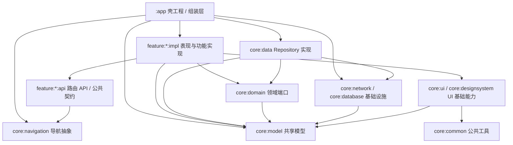
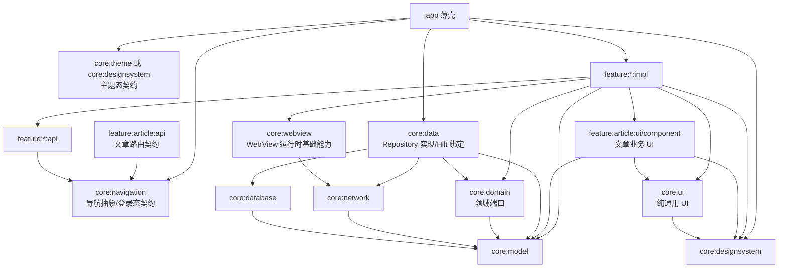

## 项目分层架构评审

**评审时间**：2026-09-20

**评审范围**：

- `app` 壳工程与导航组装层
- `core/*` 基础能力、领域、数据与 UI 模块
- `feature/*/api` 与 `feature/*/impl` 功能模块拆分
- 当前关注页面：`feature/home/impl/src/main/java/com/example/fragmject/feature/home/ui/project/ProjectScreen.kt`

### 总体结论

当前项目的主干分层方向是正确的，已经形成了较清晰的多模块结构：

- `app` 负责应用入口、全局初始化、导航注册与功能模块组装。
- `core` 承载跨功能基础能力，包括模型、领域接口、数据实现、网络、数据库、通用 UI、设计系统与导航抽象。
- `feature:*:api` 暴露跨模块导航 key 或少量公共契约。
- `feature:*:impl` 承载具体页面、ViewModel 和功能实现。

综合评价：**现状 7.0 / 10；若按目标整改可提升到 8.5 / 10**。

主要优点：

- `core` 层没有反向依赖 `feature` 层。
- `feature` 层没有直接穿透访问 `core:data`、`core:network`、`core:database`。
- ViewModel 基本通过 `core:domain` 中的 repository 接口获取数据，数据实现位于 `core:data`。
- 跨功能导航主要通过 `feature:*:api` 暴露的 `NavKey` 完成，模块边界具备基本约束。

核心判断：**当前能编译、当前业务在用，不等于分层设计合理。** 如果目标是优秀的分层架构，不能把既有业务设计造成的依赖当成不可调整结论，而应区分：

- **事实判断**：某依赖当前存在，直接删除会编译失败。
- **架构判断**：该依赖是否应该长期存在。
- **整改判断**：通过代码重构或业务边界调整，使不合理依赖消失。

主要风险：

- `app` 当前直接消费登录态、主题态、WebView 生命周期、图片选择共享 ViewModel 等业务/运行时细节；这些不是优秀壳工程的长期职责，应通过契约与生命周期分发下沉。
- `feature:home:impl` 不应被简单合理化为“天然导航中心”。它可以承载入口容器，但具体业务页面不应持续吸收跨 feature 路由知识；必要时应拆出独立业务 feature 或上移路由编排。
- `feature:article:api` 中的 `WebViewPool` 虽是接口契约，但一旦被 `app` 调用生命周期方法、被 `demo` 复用工具能力，就说明 WebView 运行时边界已经外溢，需要重新归类为 article 内部能力或通用基础能力。
- `app` 直接持有 `feature:picture:impl` 内部 ViewModel，属于明确实现泄漏，应整改，而不是因为共享状态存在就保留。
- `core:ui` 中的文章业务 UI 被多处复用，说明复用价值真实存在，但并不意味着应继续放在通用 UI core；更合理的目标是抽成业务 UI 契约模块。
- `core:data` 应用了 Compose 插件，但源码未体现 Compose 使用，数据层构建能力偏重。

### 当前分层结构

### 分层规则评估

#### 1. `core` 层边界

当前 `core` 层整体边界较好：

- 未发现 `core` 反向依赖 `feature`。
- `core:domain` 主要定义 repository 接口。
- `core:data` 负责 repository 实现，并依赖 `core:network`、`core:database`。
- `core:network`、`core:database` 作为基础设施层，依赖方向合理。

需要关注的是：

- `core:domain` 使用了 AndroidX Paging 的 `PagingData`。
- `core:ui` 依赖 `core:model`，并包含业务型 UI 组件，例如文章卡片相关组件。
- `core:data` 应用了 Compose 插件，但数据层源码没有发现 Compose 使用痕迹。

结论：**主方向正确，但 core 内部仍有一些职责偏厚或依赖偏重的问题。**

#### 2. `feature` 层边界

当前 feature 拆分为 `api` 与 `impl` 两层，这是比较好的模块化设计：

- `feature:*:api` 用于暴露跨模块导航 key 或公共契约。
- `feature:*:impl` 用于承载页面、状态管理和功能实现。
- 未发现 `feature:*:impl` 依赖其他 `feature:*:impl` 的 Gradle 依赖。
- 未发现 `feature` 源码直接 import `core:data`、`core:network`、`core:database`。

需要关注的是：

- `feature:home:impl` 依赖多个其他 feature 的 API 模块；入口层依赖 API 可以接受，但具体业务 Screen 不应持续直接创建跨 feature 路由。
- `feature:article:api` 中承载了 WebView 运行时相关契约与工具；由于 `app`、`article`、`demo` 都已触达这些能力，目标上应重新归类到 `core:webview` 或 article 内部生命周期观察者。
- `app` 中直接 import 了 `feature:picture:impl` 内部 UI ViewModel。

结论：**feature 的 api/impl 拆分方向正确，但 API 模块不能成为运行时工具与业务 UI 的承载层；后续重点是将跨业务基础能力抽到 core，将 feature 内部状态封装回 impl。**

#### 3. `app` 层职责

`app` 当前承担了以下职责：

- 应用入口初始化。
- 全局依赖注入入口。
- 导航图组装。
- 各 feature 导航注册。
- 部分全局资源释放或初始化逻辑。

这些职责大体符合 app 壳工程定位。

但当前 `app` 的依赖较宽，直接依赖了多个 core 基础模块与所有 feature impl 模块。部分依赖是合理的，例如：

- 依赖 `feature:*:impl` 用于导航注册。
- 依赖 `core:data` 用于 Hilt 绑定进入应用依赖图。
- 依赖 `core:network` 用于 `Application` 中的网络相关初始化。

需要进一步确认和收敛的是：

- 是否需要直接依赖 `core:database`（当前 `app/src` 未发现直接 import）。
- 是否需要直接依赖 `core:ui`（当前 `app/src` 未发现直接 import）。
- `core:domain` 当前被 `AppNavViewModel` 与 `MainActivity` 直接使用，这是现状事实；目标上应通过更窄的应用级契约剥离，而不是把 domain repository 长期暴露给 app。
- `app` 是否应该直接持有 feature 内部 ViewModel。
- `app` 是否应该直接管理 feature 私有运行时资源，例如 article 的 WebView 池。

结论：**app 层应从“可运行的组装层”升级为“薄壳组装层”：只保留启动、依赖装配、导航容器和全局 UI 容器，不直接消费业务 repository、feature 内部 ViewModel 或 feature 私有资源生命周期。**

### 对前次回复内容的再评估

整体判断：**前次回复对“当前源码事实”的判断基本准确，但对“是否应该整改”的判断过于保守，存在把现有业务设计合理化的倾向。** 本文档后续应以目标架构为准，而不是以当前依赖能否直接删除为准。

需要修正的判断：

- `app -> core:domain`：前次回复认为“当前在用所以不可移除”。这只是编译事实，不是目标结论。优秀壳工程不应直接消费 `UserRepository`、`ThemeRepository` 这类领域仓储；应通过 `core:navigation`/`core:designsystem` 的应用级契约，或由 feature 自己提供状态能力，使 `app` 只做组装。
- `WebViewPool`：前次回复认为“接口放 API 是合理模式”。这只在调用方也是 article feature 内部时成立。现在 `app` 调用 `prepare`、`trimToSpare`、`releaseAll`，说明 article 的运行时资源生命周期外溢到 app；如果 WebView 是通用运行时能力，应抽到 `core:webview`，如果只服务文章，应由 article 内部接入应用生命周期分发。
- `ArticleCard`：前次回复认为“被多个 feature 复用所以不建议拆”。复用事实不等于 core 归属合理。文章卡片是业务 UI，不应长期放在通用 `core:ui`；更优方案是建立 `feature:article:ui` 或 `feature:article:component` 这类业务 UI 契约模块。
- `home` 导航职责：前次回复认为“home 天然是导航枢纽”。更准确的表述是：home 可以是入口容器，但具体 tab/screen 不应不断吸收跨 feature 路由类型。若入口页继续膨胀，应拆业务入口或上移导航编排。
- `PictureViewModel`：前次回复把它放到中优先级且强调作用域难点。实际它是明确的实现泄漏，应该作为 P1 设计整改；难点在于共享状态作用域设计，而不是是否整改。

仍然准确的判断：

- `core:data` 不应应用 Compose 插件，是确定的构建层污染。
- `feature:*:impl -> feature:*:impl`、`core -> feature` 这类边界应通过工程规则强制约束。
- README 旧结构需要同步，但这只是文档修复，不应替代架构整改。

整改原则：

- **先定义目标边界，再反推业务调整。** 不因“当前业务写在这里”就接受不合理依赖。
- **先消灭 app 对业务状态和 feature 内部实现的直接认知。** 壳工程只应知道应用生命周期、导航装配和全局 UI 容器。
- **把复用从 core 中分层表达出来。** 通用 UI、业务 UI、运行时基础设施、业务 feature API 不能混为一层。
- **每项整改都给出代码路径和验收标准。** 能直接改代码的先改；涉及业务边界的给出迁移方案。

### 重点问题与真正整改方案

#### 问题 1：`app` 层过厚，直接消费业务状态与基础设施细节

表现：

- `app` 同时依赖多个 core 基础模块和所有 feature impl 模块。
- `AppNavViewModel` 直接依赖 `UserRepository` 获取登录态，用于 `RequiresAuth` 路由守卫。
- `MainActivity` 直接依赖 `ThemeRepository` 获取主题态。
- `MainActivity` 与 `FragmjectApplication` 直接依赖 `WebViewPool`，管理 article WebView 的预热与内存回收。
- `AppNavGraph` 直接依赖 `PictureViewModel`，参与 picture feature 的内部状态管理。

影响：

- `app` 从壳工程变成了业务状态、运行时资源和导航组装的混合层。
- 当前“在用所以不可删”的依赖会持续吸引新业务逻辑进入 `app`。
- feature 内部实现变化可能导致 app 修改，削弱模块隔离。

目标结论：

- `app -> core:domain` 不是长期目标依赖。当前直接删除会失败，但应通过状态契约剥离。
- `app -> feature:article:api` 的 WebView 生命周期调用不是理想边界，应改为生命周期分发或通用 `core:webview`。
- `app -> feature:picture:impl` 的内部 ViewModel 依赖应消除。
- `app -> core:database`、`app -> core:ui` 如果没有源码使用，应直接移除。

整改方案：

1. **登录态守卫从 `app` 剥离**
   - 在 `core:navigation` 增加窄接口，例如 `AuthStateProvider` / `LoginStateProvider`，只暴露 `StateFlow<Boolean>` 或 `StateFlow<AuthState>`。
   - 在 `feature:auth:impl` 或更合适的账号模块中实现该接口，内部依赖 `UserRepository`。
   - `AppNavGraph` 只依赖 `core:navigation` 的登录态契约，不直接依赖 `UserRepository` 或 `User` 模型。
   - 验收：`app/src` 不再 import `core.domain.repository.UserRepository`、`core.model.User`。

2. **主题态从 repository 直连改为设计系统契约**
   - 在 `core:designsystem` 或独立 `core:theme` 增加 `ThemeStateProvider`/`AppThemeController` 契约。
   - 由 `core:data` 或 setting/user feature 绑定实现，内部再使用 `ThemeRepository`。
   - `MainActivity` 只观察设计系统契约，不直接访问 `ThemeRepository`。
   - 验收：`app/src` 不再 import `core.domain.repository.ThemeRepository`。

3. **WebView 运行时生命周期从 `app` 解耦**
   - 若 WebView 能力只服务文章：新增应用生命周期分发契约，例如 `AppLifecycleObserver` / `MemoryTrimObserver`，由 `feature:article:impl` 注册自身观察者，`app` 只广播生命周期事件。
   - 若 WebView 能力是正式跨业务能力：抽 `core:webview`，将 `WebViewPool`、`WebViewAssetInterceptor`、预热、资源缓存、内存回收统一迁入，article/demo 依赖 `core:webview`。
   - 当前 `demo` 与 `article` 已共同使用 `WebViewAssetInterceptor`，更推荐抽 `core:webview`，避免 `demo` 依赖 article API。
   - 验收：`app/src` 不再 import `feature.article.WebViewPool`；`feature:demo:impl` 不再依赖 `feature:article:api` 仅为复用 WebView 工具。

4. **清理 app 直接依赖**
   - 短期直接移除 `app -> core:database`、`app -> core:ui`，以构建验证是否存在隐藏依赖。
   - 在完成登录态、主题态、WebView 解耦后，再移除 `app -> core:domain`、不必要的 `app -> core:model`。
   - 验收：`app/build.gradle.kts` 仅保留应用壳真正需要的 `core:common`、`core:designsystem`、`core:navigation`、`core:data`（Hilt 聚合）、必要基础设施和各 feature impl。

#### 问题 2：`feature:home:impl` 混合了入口容器与具体业务页面职责

表现：

`ProjectScreen` 中会直接创建跨 feature 的导航 key：

- `WebNavKey`
- `UserNavKey`
- `SystemNavKey`

同时 `feature:home:impl` 依赖多个其他 feature API 模块。

影响：

- `home` 作为入口容器可以知道 Tab 与顶层入口，但具体业务页面不应持续累积跨 feature 路由类型。
- `ProjectScreen`、`SystemScreen`、首页推荐流等页面如果都直接创建其他 feature 的 `NavKey`，会让 screen 层承担导航编排职责。
- 长期看，`home` 会变成第二个 app 壳，只是依赖的是各 feature API 而不是 impl。

整改方案：

1. **短期边界约束**
   - 明确允许 `feature:home:impl` 依赖其他 feature 的 API，但只允许在入口容器/导航编排文件中使用。
   - 具体 Screen 层尽量只暴露语义事件，例如 `onArticleClick(article)`、`onAuthorClick(userId)`、`onChapterClick(chapterId)`。
   - 在 `feature:home:impl` 内部建立一个小型 mapper/handler，将语义事件转换为具体 `NavKey`。

2. **中期业务边界调整**
   - 如果 `ProjectScreen` 本质是“项目文章列表”，可考虑拆为独立 `feature:project:api/impl`，`home` 只负责把它挂到 Tab 或入口。
   - 如果 `SystemScreen` 本质是“体系文章列表”，可考虑拆为独立 `feature:system:api/impl`。
   - `home` 保留 Main Tab、首页容器、我的页入口等真正首页职责。

3. **验收标准**
   - `ProjectScreen` 等具体 Screen 不直接 import 其他 feature 的 `NavKey`。
   - 跨 feature 路由创建集中在 `feature:home:impl` 的导航编排层，而不是分散在页面 UI 层。
   - 若拆分业务 feature，`home` 只依赖新 feature 的 API，不依赖其 impl。

#### 问题 3：WebView 能力边界外溢到 `app` 与 `demo`

表现：

`feature:article:api` 中包含两个 WebView 相关符号：

- `WebViewPool`：形式上是接口契约，实现位于 `feature:article:impl`。
- `WebViewAssetInterceptor`：静态工具对象，被 `feature:article:impl` 与 `feature:demo:impl` 共同引用。

更关键的是：

- `MainActivity` 调用 `WebViewPool.prepare(applicationContext)` 做预热。
- `FragmjectApplication` 在 `onTrimMemory`/`onLowMemory` 中调用 `trimToSpare()`、`releaseAll()`。
- `feature:demo:impl` 为复用 `WebViewAssetInterceptor` 依赖 article API。

影响：

- 即使 `WebViewPool` 是接口，`app` 仍然知道了 article WebView 的运行时生命周期细节。
- `demo` 依赖 article API 复用 WebView 工具，说明该能力已经不再是 article 私有契约。
- `feature:article:api` 被迫承载“导航契约 + WebView 运行时 + 静态资源工具”，API 语义变厚。

整改方案：

1. **推荐方案：抽 `core:webview`**
   - 新增 `core:webview` 模块，承载 WebView 池、预热、回收、静态资源拦截、WebView 缓存等跨业务 WebView 基础能力。
   - `feature:article:impl` 依赖 `core:webview` 渲染文章 WebView。
   - `feature:demo:impl` 依赖 `core:webview` 做演示，不再依赖 `feature:article:api`。
   - `app` 如果必须触发生命周期，只依赖 `core:webview` 的应用级生命周期入口，而不是 article API。

2. **备选方案：article 私有化 + 生命周期观察者**
   - 如果 WebView 能力确认只服务文章，将 `WebViewPool` 与 `WebViewAssetInterceptor` 下沉到 `feature:article:impl`。
   - 在 `core:common` 或 `core:navigation` 定义 `AppLifecycleObserver`/`MemoryTrimObserver` 契约。
   - `feature:article:impl` 注册观察者处理预热和内存回收，`app` 只分发生命周期事件。
   - `demo` 不再复用 article WebView 工具，如需演示则复制最小演示实现或改依赖 `core:webview`。

3. **推荐落地路径**
   - 当前已经存在 `article + demo + app` 三方共同触达 WebView 能力，因此优先按 `core:webview` 抽取。
   - 抽取后 `feature:article:api` 只保留 `WebNavKey`、`VideoDownloadNavKey` 等跨模块路由契约。

4. **验收标准**
   - `feature:article:api` 不再包含 `WebViewPool`、`WebViewAssetInterceptor`。
   - `feature:demo:impl` 不再因为 WebView 工具依赖 `feature:article:api`。
   - `app/src` 不再 import `com.example.fragmject.feature.article.WebViewPool`。

#### 问题 4：`app` 直接持有 `PictureViewModel`

表现：

`app` 导航图中直接使用 `feature.picture.ui.selector.PictureViewModel`，用于图片选择、预览、编辑多个页面共享状态。

影响：

- `app` 知道了 `feature:picture:impl` 的内部 UI 包结构。
- feature 内部状态管理泄漏到 app。
- 后续修改 picture 模块内部 ViewModel 时，可能影响 app 层。

目标结论：**这是明确的实现泄漏，应作为 P1 整改，而不是因共享状态存在就接受。**

整改方案：

1. **模块内封装共享状态**
   - `registerPictureNavContents()` 不再要求 app 传入 `PictureViewModel`。
   - `feature:picture:impl` 内部负责获取/创建共享状态对象。
   - app 只调用无参注册入口。

2. **作用域设计选项**
   - 简单方案：在 picture feature 内建立 `PictureSelectionSession`，由 `remember`/CompositionLocal 或 feature 内部 holder 管理，生命周期绑定到 picture 导航流程。
   - ViewModel 方案：由 `feature:picture:impl` 内部创建共享 `ViewModelStoreOwner` 或基于 Navigation back stack 的 parent scope 获取同一个 ViewModel。
   - 业务方案：把选择、预览、编辑看作一次“图片处理会话”，在 `feature:picture:api` 暴露 `PictureSessionNavKey(sessionId)`，状态保存在 picture impl 内部 session store。

3. **推荐落地路径**
   - 先改为 `registerPictureNavContents()` 无参，内部用稳定作用域获取同一个 `PictureViewModel`。
   - 如果 Navigation 3 的 entry 作用域无法天然共享，再引入 picture 内部 `PictureSessionStore`，不要把 ViewModel 上抛给 app。

4. **验收标准**
   - `AppNavGraph` 不再 import `feature.picture.ui.selector.PictureViewModel`。
   - `AppNavGraph` 只调用 `registerPictureNavContents()`。
   - picture 选择、预览、编辑三页的选中状态仍可共享，退出流程后状态可清理。

#### 问题 5：`core:domain` 依赖 AndroidX Paging

表现：

多个 repository 接口返回 `PagingData`。

影响：

- 从严格 Clean Architecture 角度看，领域层依赖了 AndroidX 分页框架类型。
- 领域层纯净度降低。

评估：

- 对 Android App 来说，`PagingData` 作为 domain 层返回类型是一种常见的实用主义选择。
- 当前不属于高优先级问题。

建议：

- 当前阶段可以继续保留。
- 如果后续追求更严格的领域层纯净度，再考虑引入 use case 层或自定义分页抽象。

#### 问题 6：`core:data` 应用了 Compose 插件

表现：

`core:data` 应用了 `fragmject.android.compose`，但数据层源码没有发现 Compose 使用。

影响：

- 数据层构建能力偏重。
- 模块职责表达不够准确。
- 增加不必要的构建配置复杂度。

建议：

- 从 `core:data` 移除 Compose 插件。
- 数据层只保留 Android Library、Kotlin、Hilt、序列化、Room/网络等必要能力。

#### 问题 7：`core:ui` 包含文章业务 UI 组件

表现：

`core:ui` 中存在文章卡片和文章模型映射相关组件，例如 `ArticleCard`、`ArticleCardUiState`、`toArticleCardUiState`。

影响：

- `core:ui` 不再只是通用 UI 组件库。
- `core:ui` 依赖 `core:model` 并理解 `Article` 领域对象，说明它已经承载业务展示语义。
- 文章业务 UI 被多个 feature 复用，说明它确实需要共享，但共享位置不应是通用 UI core。

目标结论：**复用价值真实存在，但归属应从 `core:ui` 调整到文章业务 UI 契约模块。**

整改方案：

1. **新增业务 UI 契约模块**
   - 推荐新增 `feature:article:component` 或 `feature:article:ui`。
   - 模块承载 `ArticleCard`、`ArticleCardUiState`、`toArticleCardUiState`、文章骨架屏等文章展示组件。
   - `feature:home:impl`、`feature:collection:impl`、`feature:user:impl`、`feature:search:impl` 依赖该模块复用文章 UI。

2. **保持 `core:ui` 纯通用**
   - `core:ui` 保留 `PagingSwipeRefreshBox`、基础 loading/error/empty 容器、通用 toolbar、通用骨架能力等无业务语义组件。
   - `core:ui` 不再直接依赖 `core:model` 的业务模型。

3. **渐进迁移路径**
   - 第一步新建文章 UI 模块并复制/迁移 `ArticleCard` 相关文件。
   - 第二步批量替换各 feature 中的 import。
   - 第三步从 `core:ui` 删除文章组件，并尝试移除 `core:ui -> core:model` 依赖。

4. **验收标准**
   - `core/ui/src` 不再出现 `ArticleCard`、`ArticleCardUiState`、`Article` 映射。
   - `core:ui` 的 Gradle 依赖不再需要 `core:model`。
   - 文章卡片调用方改依赖 `feature:article:component` 或 `feature:article:ui`。

### 当前 `ProjectScreen` 评价

文件：`feature/home/impl/src/main/java/com/example/fragmject/feature/home/ui/project/ProjectScreen.kt`

优点：

- 页面没有直接访问 `core:data`、`core:network`、`core:database`。
- 数据来源通过 `ProjectTreeViewModel`、`ProjectListViewModel` 间接获取。
- ViewModel 通过 `ProjectRepository` 领域端口获取项目分类和分页列表。
- UI 逻辑集中在 Composable 中，页面职责清晰。

风险：

- 页面直接创建 `WebNavKey`、`UserNavKey`、`SystemNavKey`，对跨 feature 导航类型感知较强。
- 使用 `ArticleCard` 与 `toArticleCardUiState` 说明文章卡片能力被放在 `core:ui`，存在业务 UI 下沉到 core 的问题。

整改建议：

- `ProjectScreen` 不应直接创建 `WebNavKey`、`UserNavKey`、`SystemNavKey`。
- 将页面回调改为业务语义事件，例如 `onArticleClick(article)`、`onAuthorClick(userId)`、`onChapterClick(chapterId)`。
- 在 `feature:home:impl` 的导航编排层集中把语义事件转换为具体 `NavKey`。
- 若 Project 业务继续扩大，应拆为 `feature:project:api/impl`，由 `home` 只负责挂载入口。

### 整改优先级

#### P0：边界红线（持续保持，并工程化约束）

- 禁止 `core -> feature` 反向依赖。
- 禁止 `feature -> core:data/network/database` 源码穿透。
- 禁止 `feature:*:impl -> feature:*:impl` 依赖。
- 将以上规则固化到 convention 插件或 CI 检查中，避免只靠文档约束。

#### P1：优先整改（明确分层问题，建议下一轮直接改代码）

- 移除 `core:data` 中不必要的 Compose 插件。
- 让 `app` 不再直接持有 `PictureViewModel`，将 picture 共享状态封装回 `feature:picture:impl`。
- 从 `app` 剥离 `UserRepository`/`ThemeRepository` 直连：通过登录态契约、主题态契约替代 `app -> core:domain` 的直接业务仓储依赖。
- 抽取 `core:webview` 或引入生命周期观察者机制，消除 `app` 对 `feature.article.WebViewPool` 的直接调用。
- 移除 `app -> core:database`、`app -> core:ui` 这类当前无源码 import 的直接依赖，并用构建验证。

#### P2：结构优化（涉及模块新增或业务边界调整）

- 将 `ArticleCard`、`ArticleCardUiState`、`toArticleCardUiState` 从 `core:ui` 迁移到 `feature:article:component` 或 `feature:article:ui`。
- 将 `ProjectScreen`、`SystemScreen` 等具体业务页面的跨 feature NavKey 创建上移到 `home` 导航编排层。
- 若项目、体系业务继续增长，拆出 `feature:project:api/impl`、`feature:system:api/impl`，`home` 只负责入口挂载。
- 若采用 `core:webview`，同步迁移 `WebViewAssetInterceptor`、WebView 缓存与 WebView 池能力，解除 `demo -> article:api` 的工具复用依赖。

#### P3：长期演进（高成本，架构成熟后处理）

- 评估 `core:domain` 是否继续暴露 AndroidX Paging 的 `PagingData`，必要时引入 use case 或自定义分页抽象。
- 进一步拆分 `core:domain` 中不同业务域 repository，避免领域端口层逐渐变成大杂烩。
- 统一模块命名与 convention 插件命名，例如将 `fragmject.android.feature` 中的序列化/parcelize 能力拆成更准确的插件。

### 推荐目标形态

目标约束：

- `app` 是薄壳：不直接依赖业务 repository，不持有 feature 内部 ViewModel，不管理 feature 私有资源生命周期。
- `core` 不依赖 `feature`。
- `feature:*:impl` 不依赖其他 `feature:*:impl`。
- `feature:*:api` 只暴露跨模块路由 key、marker interface 和真正需要跨 feature 使用的窄契约。
- WebView 预热、缓存、资源拦截、内存回收属于 `core:webview` 或 article 内部生命周期观察者，不放在 `feature:article:api` 中混用。
- `core:ui` 只承载通用 UI；文章业务 UI 迁移到 `feature:article:ui`/`feature:article:component`。
- `core:data` 只处理数据实现，不引入 Compose。

### 可落地项分级（目标导向版）

> 本节用于把整改拆成「可直接代码处理」「需要新增契约」「需要业务边界调整」三类。不是因为当前业务在用就降级，而是按架构收益、风险和改造规模排序。

#### ✅ 可直接代码处理

| 项 | 落地动作 | 验收 |
|---|---|---|
| 移除 `core:data` 的 Compose 插件 | 删除 `id("fragmject.android.compose")` | `./gradlew :core:data:assemble` 通过 |
| 移除 app 无用依赖 | 删除 `app -> core:database`、`app -> core:ui`，按构建结果校正 | `./gradlew :app:assembleFreeDebug` 通过 |
| `PictureViewModel` 下沉 | `registerPictureNavContents()` 内部管理共享状态，app 不传 ViewModel | `app/src` 无 `PictureViewModel` import |
| README 同步 | 更新旧模块结构描述 | 文档与 `settings.gradle.kts` 一致 |

#### 🟡 需要新增契约/模块后处理

| 项 | 推荐方案 | 验收 |
|---|---|---|
| 登录态守卫 | `core:navigation` 定义登录态契约，auth/account 实现 | app 不再依赖 `UserRepository`/`User` |
| 主题态读取 | `core:designsystem` 或 `core:theme` 定义主题态契约 | app 不再依赖 `ThemeRepository` |
| WebView 能力归属 | 新增 `core:webview`，迁移 `WebViewPool`/`WebViewAssetInterceptor` | article API 只保留路由契约；demo 不依赖 article API |
| 文章业务 UI | 新增 `feature:article:ui`/`feature:article:component` | `core:ui` 不再依赖 `core:model` 的文章模型 |
| 依赖规则工程化 | convention 插件或 CI 校验依赖方向 | 违规依赖构建失败 |

#### 🟠 需要业务边界调整

| 项 | 业务调整方案 | 验收 |
|---|---|---|
| `home` 入口职责收敛 | Screen 发语义事件，导航编排层转 NavKey | 具体 Screen 不直接 import 跨 feature NavKey |
| `project/system` 业务增长 | 拆为独立 `feature:project`、`feature:system` | home 只负责入口挂载 |
| domain 分页纯净化 | 引入 use case 或分页抽象替代直接暴露 `PagingData` | repository 接口不再泄漏 AndroidX paging 类型 |

### 结论

当前项目的基础模块化方向是对的，但若目标是“优秀的分层架构”，下一阶段不能只做低风险清理，也不能把现有业务依赖解释为合理。真正的整改重点是：

- **薄化 `app`**：移除 app 对业务 repository、feature 内部 ViewModel、feature 私有资源生命周期的直接认知。
- **重新归类复用能力**：WebView 属于运行时基础能力时进 `core:webview`；文章卡片属于业务 UI 复用时进 `feature:article:ui/component`。
- **收敛入口模块职责**：`home` 可以做入口容器，但具体业务页面应通过语义事件与导航编排隔离。
- **工程化约束边界**：把模块依赖方向写入构建规则，而不是只写在文档里。

推荐按 P1 先处理 `PictureViewModel` 下沉、`app` 直接依赖清理、登录/主题/WebView 契约化；再推进文章 UI 模块与 home 业务边界拆分。
